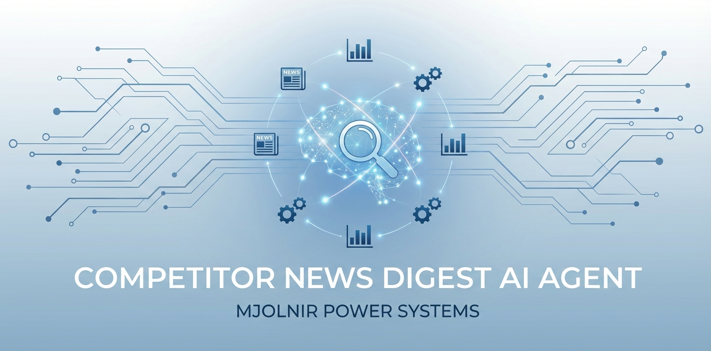

# Competitor News Digest
## Multi agent system that automates, competitor news tracking, M&A Analysis, and infographic creation

Competitor News Digest is a multi-agent competitor-intelligence system built with the Google Agent Development Kit (ADK) for a fictional OEM, **Mjolnir Power Systems**, which competes with Eaton, Schneider Electric, and Vertiv in power distribution and data-center market. The system automates the pipeline from **“raw competitor news on the web”** to **structured executive briefings and M&A deep-dive reports** that can be dropped straight into email, documentation, or reports. Instead of analysts repeatedly Googling the same competitors and manually stitching information together, Agent centralizes news collection, triage, and reporting into a reusable workflow.

---

## Problem Statement

The Corporate Strategy team at Mjolnir Power Systems starts each Monday morning the same way: spending 3-4 hours manually scanning news sites, Google Alerts, and industry publications for competitor movements. They're looking for M&A activity, product launches, and strategic shifts from Eaton, Schneider, and Vertiv. By the time they compile their weekly brief for the C-suite, it's already Wednesday, and the insights are stale.

The pain points are fairly consistent:

- **High monitoring overhead**  
  Analysts spend several hours a week manually scanning PR pages, industry blogs, financial media, and niche news sites for each key competitor. This is repetitive and hard to scale as the competitor list or geography expands.

- **Fragmented, non-reusable information**  
  Even when someone is diligent, the output often lives in email threads, PowerPoint decks, or one-off spreadsheets. There is no persistent, queryable store of “what Eaton/Schneider/Vertiv has been up to in the last quarter.”

- **Slow response on major events**  
  When a big M&A deal hits, CI teams scramble: re-Google the same company, pull deal basics from multiple articles, and then manually assemble a memo or slide. The same pattern repeats for every new event, with a lot of duplicated effort.

- **Inconsistent quality and format**  
  Different analysts write in different styles. Briefings and M&A notes end up inconsistent in structure, depth, and focus, which makes them harder to reuse for leadership decks and longer-term analysis.

Net result: valuable time is burned on **low-leverage, manual work** (searching, copy-pasting, reformatting) rather than **high-leverage thinking** (interpreting strategic implications, scenario analysis, and recommendations).

---

## Solution Statement

Our Agent is designed to automate the **news → triage → analysis → report** pipeline for competitor news in power-infrastructure markets.

At a high level, the system does four things:

1. **Collect**  
   Query the web for a configurable set of competitors (default: Eaton, Schneider, Vertiv) and a time window (default: last 30 days). Normalize raw search results into a structured **news digest**: company, date, headline, short summary, category, and source URL.

2. **Triage**  
   Automatically identify items that look like **M&A deals, strategic partnerships, significant investments, or launches**. This separates “background noise” from events that deserve deeper analysis.

3. **Analyze**  
   For selected events, run a specialised **M&A report writer** that pulls more context, infers strategic rationale, and drafts a structured report that a CI analyst could realistically send to leadership with minimal edits.

4. **Deliver**  
   Combine the above into:
   - An **Executive News Digest**: a concise, company-wise list of recent moves.
   - One or more **M&A Intelligence Reports**: detailed notes formatted as markdown, ready for email, or a CI knowledge base.

The goal is to **eliminate repetitive grunt work** so analysts spend time on questions like “What does this deal mean for our portfolio?” rather than “Where’s the press release link again?”

---

## Architecture

The system is built around a central orchestrator agent plus a small set of specialised agents and tools. It uses ADK state to pass information between components in a controlled way.

### Orchestrator: `competitor_news_digest_agent`

The orchestrator is a top-level `LlmAgent` that behaves like a CI project lead. It:

- Accepts input such as:
  - List of competitors (default: Eaton, Schneider Electric, Vertiv)
  - Time window or date range
  - Focus area (e.g., “M&A only” vs “all strategic news”)
- Invokes a dedicated **news collection agent** as an AgentTool.
- Examines the resulting digest and selects items that look like M&A or strategic deals.
- For each selected item, calls the **M&A report writer**.
- Optionally calls an **infographic generator**.
- Assembles a final markdown report containing:
  - Company-wise news list
  - Attached M&A report
  - Detailed Infographic

State is managed through `ToolContext.state`. Typical keys:

- `state["news_digest"]`: a company wise news items summary.
- `state["mna_report"]`: the latest M&A report content.

This keeps data flow explicit and avoids hidden globals.

### News Collection Agent: `news_collector`

`news_collector` is an `LlmAgent` wrapped as an AgentTool. It owns a single responsibility: **turn web search results into a structured digest**.

Given competitors and a time window, it:

- Calls `google_search` with focused queries (e.g. “Eaton M&A last 30 days”).
- Interprets snippets and hits to extract:
  - `company`
  - `date` (approximate if necessary)
  - `headline`
  - A two-line summary
  - `url`

It then writes the resulting summary into `state["news_digest"]`. For the capstone version, this is intentionally implemented as a **single pass**: no recursive crawling or multi-loop retries. That keeps behaviour predictable while still proving the concept.

### M&A Report Writer: `mna_report_writer`

`mna_report_writer` is another `LlmAgent` exposed as an AgentTool. It is invoked for **one news item at a time** when the orchestrator decides that an entry likely represents an M&A or major strategic transaction.

Input context typically includes:

- The selected news byte (company, headline, summary, link).
- Optionally, the full `news_digest` for broader context.

The agent then:

- Uses `google_search` to fetch additional details on the specific deal.
- Drafts a structured **M&A Intelligence Report** with sections like:
  - Deal overview (who, what, when, value if available).
  - Target profile and capabilities.
  - Strategic rationale (technology, portfolio gap, geography, channel, customer segment).
  - Fit with the acquirer’s existing power / data-center portfolio.
  - Potential implications and response options for **Mjolnir Power Systems**.

The output is written to `state["mna_report"]` as markdown or a structured object. The orchestrator later retrieves this and folds it into the final briefing.

The MNA writer pipeline also consists of a **Critic + Refiner loop** (using `LoopAgent` and a separate tool to exit loop). 

### Infographic Generator: `infographic_genarator`

We leverage the power of new Nanobanana Pro model's infographic generation capabilities to create catchy infographics that will help the busy execs glance through the image and get all the highlights. 
The agent has access to a create image tool that takes the M&A report  and does a API call to get the infographic created by Nanobanana pro model.

This keeps image generation cleanly decoupled from ADK logic while still enabling visual assets for leadership decks.

### File Output Tool: `save_output`

A custom FunctionTool handles the boring but necessary task of **writing markdown files** to disk, e.g.:

- `news_digest_YYYYMMDD.md` – overview news list.
- `mna_report_<company>_<slug>.md` – individual deal analyses.

This makes it trivial to version control outputs in Git, open them in VS Code, or pipe them into other systems.

---

## Conclusion

Agent reframes competitor news tracking from a **messy, manual process** into a **repeatable, stateful pipeline**.

Instead of each analyst running their own tab-sprawl of Google searches and copying links into slides, the system centralizes:

- What was searched,
- What was found,
- How it was summarised,
- Which events were considered important enough to warrant a deep-dive.

Because the architecture is **modular**, it’s straightforward to add new capabilities:

- A separate agent that tracks only data-center capacity announcements.
- A financial-impact agent that translates deals into rough revenue / margin implications.
- A risk register agent that turns events into persistent “risk/opportunity” entries.

The core value is not flashy UI; it is the shift from **one-off manual intel** to a **compounding intelligence asset** that can be queried, reused, and extended.

---

## Value Statement

In realistic internal use for a CI/Strategy team focused on three large competitors, Agent aims to:

- Reduce **weekly monitoring time** from ~3–4 hours of manual searching, reading, and copy-pasting to **under 1 hour** of reviewing a ready digest and a small number of M&A reports.
- Standardize the **format and depth** of M&A and strategic event notes, so they are easier to plug into leadership packs, CI portals, or internal wikis.
- Build a **growing archive** of news digests and deal reports that can later support:
  - Trend analysis (e.g., where Vertiv is investing geographically).
  - Portfolio mapping exercises.
  - Quarterly and annual competitor reviews.

The outcome is a CI workflow where human effort is spent on **interpretation, challenge, and decision support**, not on repetitive information gathering.

---

## Next Steps

Concrete next steps to evolve Agent beyond the capstone implementation:

1. **Persistent Storage Layer**  
   - Move from ephemeral, per-run outputs to a persistent store:
   - Start with SQLite or a simple document store.
   - Optionally layer a vector index on top for semantic querying (“show all Eaton deals related to liquid cooling in Europe since 2023”).

2. **Source-Specific Topic Scanner**  
   Add specialised agents that monitor curated feeds such as DataCenterDynamics, company IR pages, and select industry newsletters. Use them alongside generic web search to reduce noise and improve recall for niche but important events.

3. **Financial and Scenario Extensions**  
   Introduce a follow-on agent that reads M&A reports and news digests to:
   - Roughly tag impact as “portfolio gap fill”, “geo expansion”, or “defensive move”.
   - Sketch simple scenarios and potential responses for Mjolnir Power Systems.

Together, these steps would move Agent from a focused capstone project into a **credible internal CI assistant** for a power-infrastructure strategy team.
